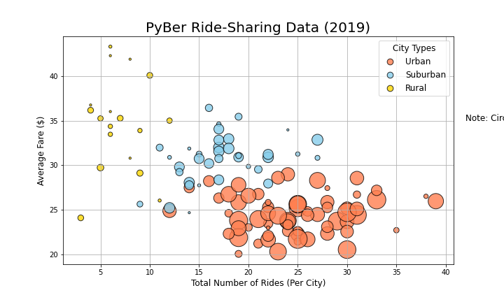

Challenge 5

Overview of the analysis: 
As a new employee, I have received a project on creating visualizations related to rideshare data for PyBer. The goal is to help improve access to ride-sharing services and determine affordability for underserved neighborhoods. 

Results: Using images from the summary DataFrame and multiple-line chart, describe the differences in ride-sharing data among the different city types.

Summary: Based on the results, provide three business recommendations to the CEO for addressing any disparities among the city types.
1.
2.
3.