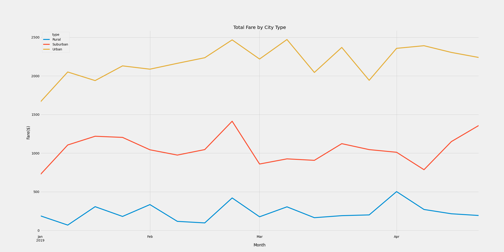
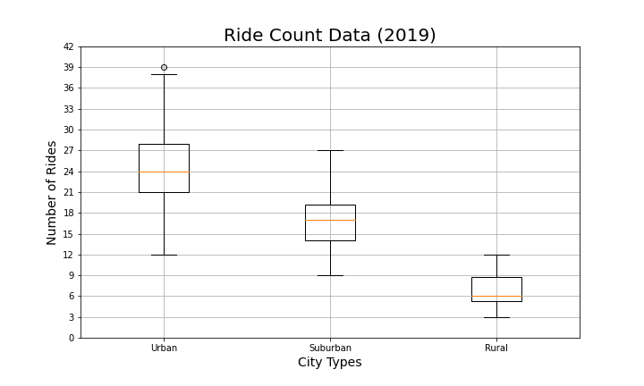
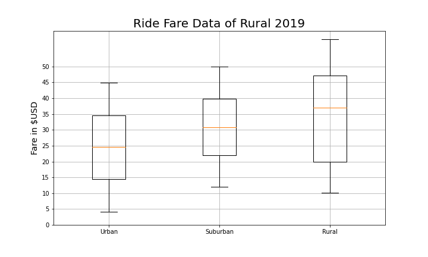
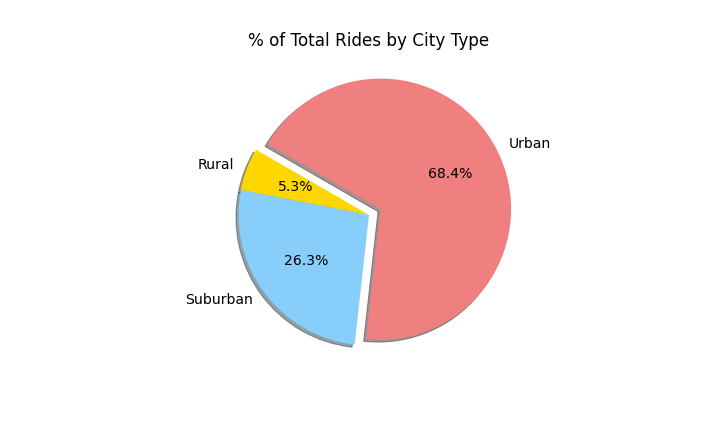

Challenge 5 Assignment

Overview of the analysis: 
As a new employee, I have received a project on creating visualizations related to rideshare data for PyBer. The goal is to help improve access to ride-sharing services and determine affordability for underserved neighborhoods. 

Results: 
Describe the differences in ride-sharing data among the different city types.
Based on the 2019 data I have received on ride-sharing, there are three types (urban, suburban, and rural). 

As shown below in the 'Ride Count Data', urban rides have the highest count with 1625, next suburban is 625 count, and the last rural is 125 count. The whiskers and plot diagram displays the mean, outliers, and the differences among three efficiently.

As with any cost effectiveness measures, the higher the number of riders and drivers, the lower the cost of fare. The cheapest cost is for urban riders $24.5, for suburban riders it is almost $31, and for rural riders it is almost $35. 

Percent total rides of three different city types in urban, suburban, and rural data is depicted in a pie-chart below. It clearly shows urban population has the highest participation with 68.4%, suburban rides are 26.3%, and the rural rides are only 5.3%.

Summary: Based on the results, provide three business recommendations to the CEO for addressing any disparities among the city types.
1. Urban population who lives nearby to downtown or major city districts make the ride-share opportunities most. 
2. Focusing on first urban locations can bring the most accessible and affordable value for now.
3. A pilot program to identify the specific niche or the need can bring an opportunity to fill in the ride-share. 